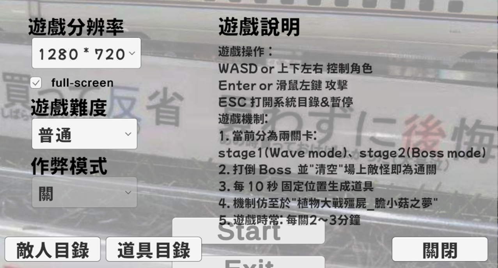
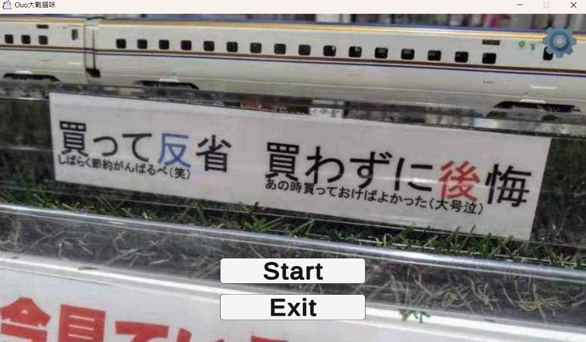
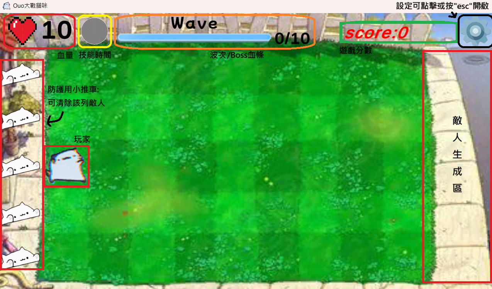
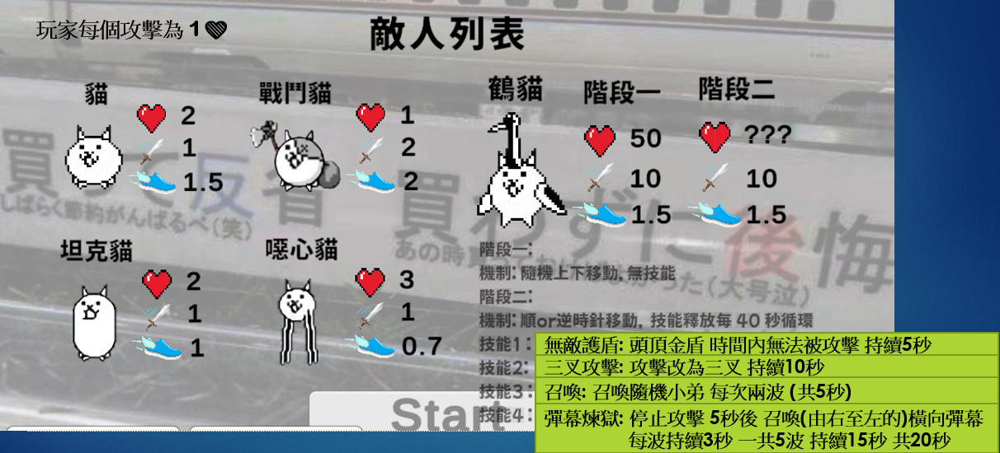
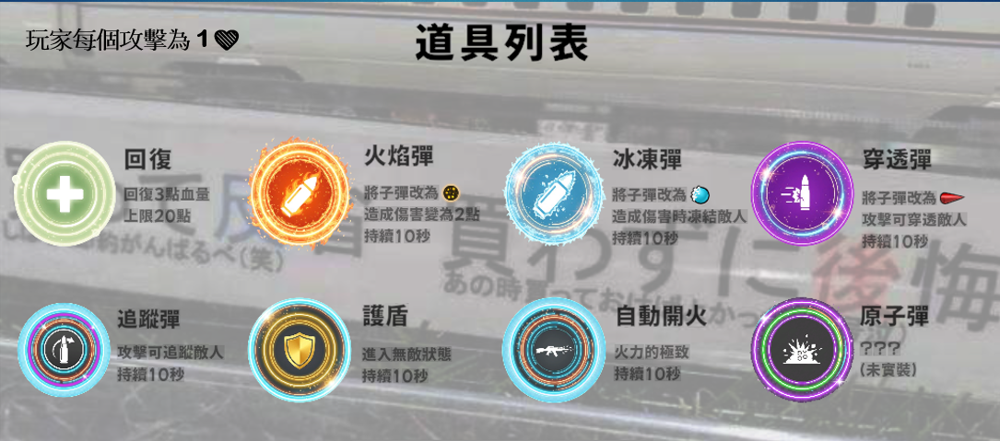

# 梗圖貓大戰貓咪 (Meme Cat vs. Cat)

一款以**植物大戰殭屍**為靈感，以**貓咪大戰爭**為元素的 2D 對戰遊戲。

## 專案說明

本遊戲由 Unity 引擎開發，結合網路流行的貓咪梗圖元素與植物大戰殭屍的遊戲玩法，打造輕鬆歡樂的對戰體驗。玩家可操控梗圖貓或一般貓咪角色進行遊戲。

當前關卡分為兩關:
- 第一關為Rush模式,目標擊敗10波敵人即可通關。
- 第二關為Boss戰,擊敗Boss即可通關。

操作說明:


## 遊戲畫面:
### 主畫面:

### 關卡畫面:

### 敵人列表:

### 道具列表:


## 遊戲特色

- 梗圖風格的視覺設計
- 貓咪對戰主題
- 輕鬆歡樂的遊戲體驗

## 技術棧

- **引擎**：Unity（Windows 64-bit 建置）
- **語言**：C#
- **渲染**：DirectX 12 (D3D12)
- **Runtime**：Mono / .NET

## 執行方式

直接執行 `梗圖貓大戰貓咪.exe` 即可開始遊戲（需 Windows 系統）。

## 檔案結構

```
Meme Cat vs. Cat/
├── 梗圖貓大戰貓咪.exe             # 遊戲執行檔
├── UnityPlayer.dll                # Unity 執行環境
├── UnityCrashHandler64.exe        # 崩潰報告工具
├── D3D12/                         # DirectX 12 相關檔案
├── MonoBleedingEdge/              # Mono 執行環境
└── 梗圖貓大戰貓咪_Data/           # 遊戲資源目錄
```

## 開發者

- **開發者**：汪章貴
- **引擎**：Unity Game Engine
